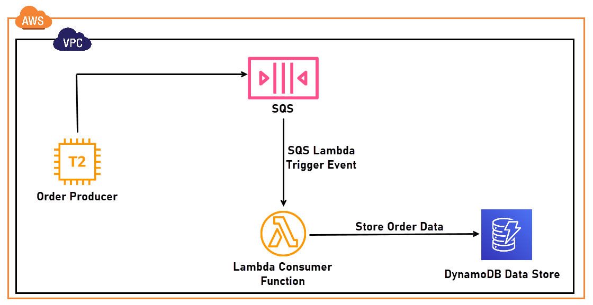

# OrderProcessing Using AWS SQS

The project is geared to emulate an Order processing system with EC2 instance that acts as a producer for AWS SQS.
Unfulfilled Orders in SQS will then be consumed by a Lambda that performs polling for new messages.
Once available; messages are consumed and deleted from the queue and data is stored in a dynamoDB table.

